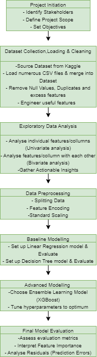

# Football Transfer Fee Analysis

## Project Overview

**Problem Area:**
The area of interest for this project revolves around football transfer fees, which entail assessing the worth of football players during transfers. In this domain, the complexities often present challenges in achieving accurate player valuation, understanding market trends, and financial planning within the football industry.

**Those Affected:**
Stakeholders encompass football clubs, managers, players, agents, and fans. These groups stand to gain significantly from unbiased, data-driven insights into player valuations and market trends, thereby making more informed decisions in the long run.

**Proposed Data Science Solution:**
This project harnesses the power of data science, machine learning, and data analytics to offer solutions in the field of football transfer fees. The proposed data science solution involves the development of predictive models for player valuations and the analysis of market trends. Leveraging historical transfer data, player performance metrics, club financials, and market sentiment analysis, this project aspires to provide insights that assist in the decision-making process during transfer negotiations.

**The Impact:**
Precise valuation of football transfer fees is not only crucial for the financial stability and success of football clubs but also for promoting fairness and transparency in player transactions. This issue spans an industry involving billions of pounds in annual football transfers, making it of paramount importance for the entire football ecosystem.

## Walkthrough Demo

...

## Project Flowchart

My Project Flowchart: 

**
## Project Organisation

The project repository is structured as follows:

- `data`: This folder contains a link to the dataset and may include any saved aggregated or processed data (if applicable).
- `model`: This folder stores a joblib dump of the final model or model object.
- `notebooks`: You can find all the final notebooks that played a role in the project in this folder.
- `reports`: The final project report summarising the analysis can be found here.
- `references`: This folder contains credits and references to relevant sources that contributed to the project.
- `src`: The refactored project source code can be accessed here.
- `.gitignore`: This file specifies files and folders to be ignored by Git version control.
- `capstone_env.yml`: The Conda environment specification is provided in this file.
- `Makefile`: Automation scripts for the project are included in this file.
- `images`: This folder will contain images.

## Dataset

**Data Source:**
The primary dataset used for this project is sourced from Kaggle and was originally extracted from Transfermarkt Data. This dataset offers a comprehensive collection of information related to player transfers, market values, and historical data, making it suitable for analysing football transfer fees.

**Granular Data Description:**
The dataset comprises the following columns, each with its data type and description:

Data Dictionary
player_id (int64): A unique identifier for each football player.

last_season_x (int64): The last season the player participated in.

country_of_citizenship (object): The player's country of citizenship.

position (object): The player's primary playing position (e.g., forward, midfielder, defender).

sub_position (object): The specific position the player plays within a broader position category.

foot (object): The preferred foot for playing (e.g., left, right).

height_in_cm (float64): The player's height in centimeters.

market_value_in_eur (int64): The market value of the player in euros, which is the target variable for your analysis.

highest_market_value_in_eur (float64): The player's highest market value in euros.

most_recent_club_id (object): The ID of the player's most recent club.

date (datetime64): A date associated with the player's record.

age (int32): The player's age, calculated from their date of birth.

contract_days_left (int64): The number of days left on the player's current contract.

year (int64): The year associated with the player's record.

goals (int32): The number of goals scored by the player that year.

assists (int32): The number of assists made by the player that year.

yellow_cards (int32): The number of yellow cards received by the player that year.

red_cards (int32): The number of red cards received by the player that year.

minutes_played (int32): The total number of minutes the player has played that year.

net_transfer_record (float64): The net transfer record of that specific club.

national_team_players (int32): The number of national team players for that specific club.

month (int64): The month associated with the player's record.

player_club_id (int64): The ID of the player's club.

league_id (object): The ID of the league.

## Credits & References

- The primary dataset was provided by DavidCariboo on Kaggle, who played a pivotal role in collating the dataset for this project.
- Additional references and sources used during the project can be found in the individual project notebooks.

--------
